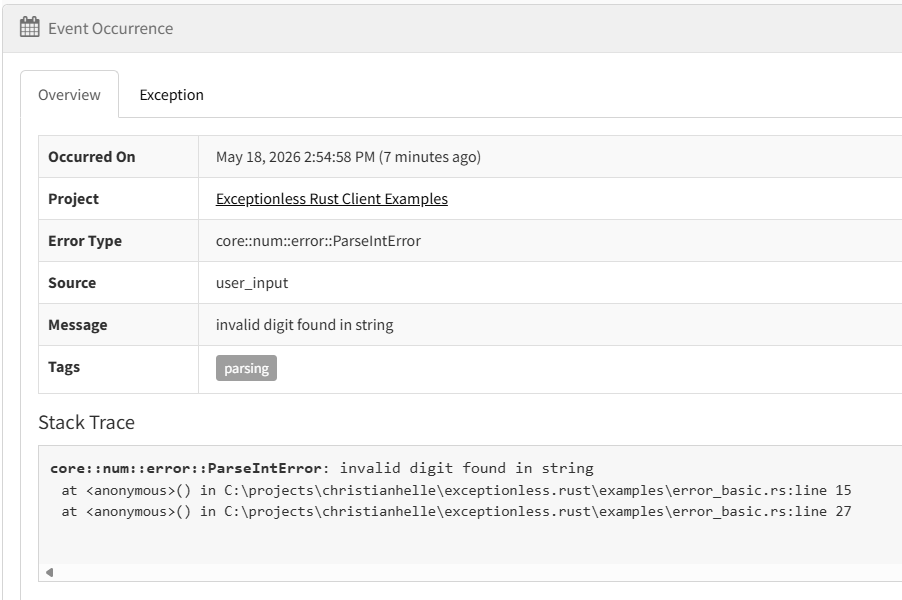
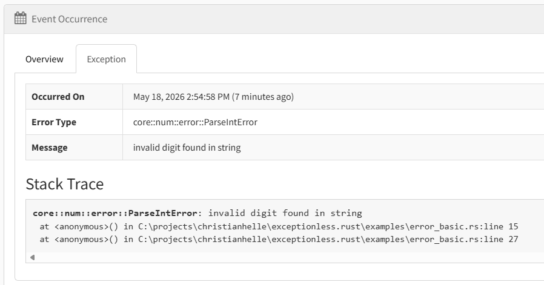
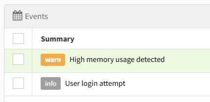
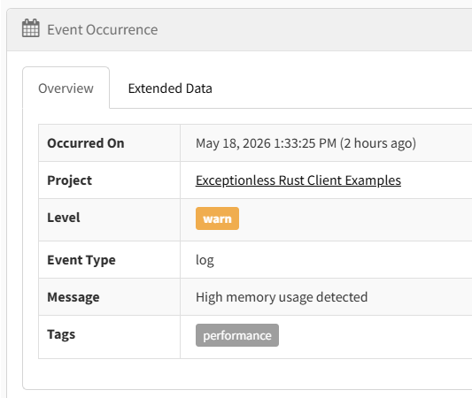
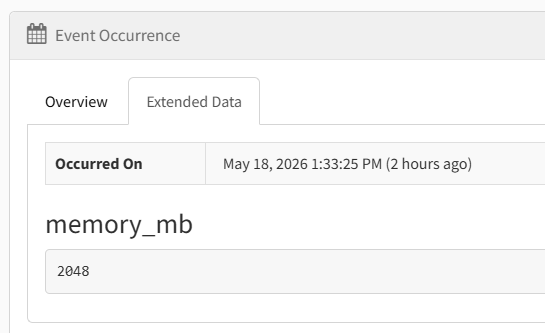
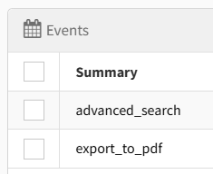
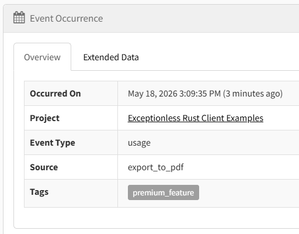
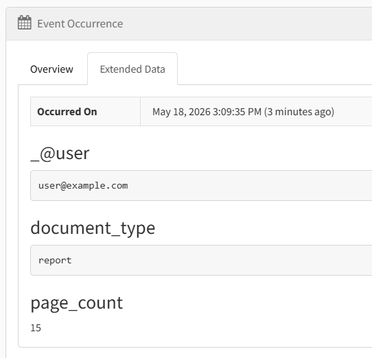

# Exceptionless Client for Rust

A Rust client for [Exceptionless](https://exceptionless.com) — capture errors, logs, and feature usage events with a clean, async-first API.

API docs: [docs.rs/exceptionless](https://docs.rs/exceptionless)

## What's Supported

This initial release focuses on core event reporting:

- **Error reporting** — submit exceptions with automatic stack trace capture and inner exception chaining
- **Log events** — send structured logs with severity levels
- **Feature tracking** — record feature usage for analytics
- **Custom metadata** — add tags, user identity, version, and arbitrary data to any event
- **Async/await** — all submission is non-blocking; the built-in HTTP transport uses `reqwest`
- **Bearer authentication** — events submitted with your API key to `collector.exceptionless.io` (or a custom server)

### Not Yet Supported

- Event queuing and offline storage
- Settings/configuration from the Exceptionless server
- Session tracking
- Plugin system
- Log level filtering or structured logging integration (upcoming)

---

## Quick Start

### 1. Add the Dependency

```toml
[dependencies]
exceptionless = "0.1"
```

If you need telemetry calls to stay wired in but become no-op successes, enable the `opt-out` feature:

```toml
[dependencies]
exceptionless = { version = "0.1", features = ["opt-out"] }
```

Opting out of telemetry data collection is a common requirement for local development and testing. With `opt-out` enabled, all calls to `.send().await?` and `submit_batch(...).await?` succeed without sending any data, so you can keep the same code paths without needing test-specific configuration or transports.

### 2. Create a Client

The simplest way to get started:

```rust
use exceptionless::ExceptionlessClient;

#[tokio::main]
async fn main() -> Result<(), Box<dyn std::error::Error>> {
    let client = ExceptionlessClient::with_api_key("YOUR_API_KEY");

    // Ready to report events
    Ok(())
}
```

`send().await` returns a `SubmissionResult`. For production code, inspect the result if you need to distinguish success from retryable or discardable responses.

### 3. Report an Error

```rust
use core::num::ParseIntError;
use exceptionless::ExceptionlessClient;

#[tokio::main]
async fn main() -> Result<(), Box<dyn std::error::Error>> {
    let client = ExceptionlessClient::with_api_key("YOUR_API_KEY_HERE");

    // Simulate a parsing error
    let result = parse();

    match result {
        Err(e) => {
            // Send the error to Exceptionless
            client
                .capture_error(&e)
                .tag("parsing")
                .source("user_input")
                .send()
                .await?;
            println!("Error reported to Exceptionless");
        }
        Ok(num) => {
            println!("Parsed number: {}", num);
        }
    }

    Ok(())
}

fn parse() -> Result<i32, ParseIntError> {
    parse_string_as_integer("not a number")
}

fn parse_string_as_integer(text: &str) -> Result<i32, ParseIntError> {
    text.parse()
}
```

The client automatically captures the error message and type. Use builder methods to add context:

- `.tag(name)` — label the event (e.g., "auth", "database", "payment")
- `.source(module)` — identify where the error originated
- `.version(v)` — track which version encountered the error
- `.user_identity(id)` — associate the error with a user
- `.data(key, value)` — attach arbitrary metadata





### 4. Send a Log

```rust
use exceptionless::ExceptionlessClient;

#[tokio::main]
async fn main() -> Result<(), Box<dyn std::error::Error>> {
    let client = ExceptionlessClient::with_api_key("YOUR_API_KEY");

    client.log("User logged in")
        .level("info")
        .tag("authentication")
        .user_identity("user@example.com")
        .send()
        .await?;

    Ok(())
}
```

Common log levels are `"trace"`, `"debug"`, `"info"`, `"warn"`, `"error"`, and `"fatal"`. The client trims surrounding whitespace and omits blank values; it does not validate against a fixed enum yet.







### 5. Track Feature Usage

```rust
use exceptionless::ExceptionlessClient;

#[tokio::main]
async fn main() -> Result<(), Box<dyn std::error::Error>> {
    let client = ExceptionlessClient::with_api_key("YOUR_API_KEY");

    client.feature("export_to_pdf")
        .tag("premium_feature")
        .user_identity("user@example.com")
        .send()
        .await?;

    Ok(())
}
```







---

## Configuration

### Custom Server

If you're self-hosting Exceptionless, point the client to your server:

```rust
use exceptionless::ExceptionlessClient;
use exceptionless::config::ClientConfig;
use exceptionless::transport::http::HttpTransport;

#[tokio::main]
async fn main() -> Result<(), Box<dyn std::error::Error>> {
    let config = ClientConfig::new("YOUR_API_KEY")
        .with_server_url("https://your-exceptionless-server.com");

    let client = ExceptionlessClient::new(config, HttpTransport::default());

    client.log("Server configured").send().await?;

    Ok(())
}
```

`exceptionless::transport::http::HttpTransport` and `ExceptionlessClient::with_api_key(...)` are available in every build. Enabling `opt-out` keeps the same API surface, but all `send()` and `submit_batch()` paths return success without sending anything.

### Disable the Client

For local development or testing, you can disable event submission:

```rust
let config = ClientConfig::new("YOUR_API_KEY")
    .with_enabled(false);
```

When disabled, `send()` and `submit_batch()` return a configuration error before any request is sent unless the `opt-out` Cargo feature is enabled, so tests should either use a test transport, enable `opt-out`, or skip submission.

### Compile-Time Opt-Out

If you enable the `opt-out` Cargo feature, telemetry submission becomes a no-op success. Calls such as `.send().await?` and `submit_batch(...).await?` still succeed, even when the client is disabled, but no request is serialized or submitted.

---

## Retry & Backoff

The client supports automatic retry with exponential jittered backoff for transient network errors (connection refused, DNS failures) and retryable HTTP responses (408, 429, 5xx).

### Quick start

Use the convenience constructor for a sensible default policy (3 attempts, 200ms–10s, full jitter):

```rust
use exceptionless::ExceptionlessClient;

let client = ExceptionlessClient::with_api_key_and_retry("YOUR_API_KEY");
```

### Custom policy

Build your own `RetryingTransport` to tune the backoff parameters:

```rust
use std::time::Duration;
use exceptionless::ExceptionlessClient;
use exceptionless::config::ClientConfig;
use exceptionless::transport::http::HttpTransport;
use exceptionless::transport::retry::{ExponentialBackoff, Jitter, RetryingTransport};

let policy = ExponentialBackoff::builder()
    .retry_bounds(Duration::from_millis(200), Duration::from_secs(10))
    .jitter(Jitter::Full)
    .base(2)
    .build_with_max_retries(2);

let transport = RetryingTransport::new(HttpTransport::default(), policy);
let client = ExceptionlessClient::new(
    ClientConfig::new("YOUR_API_KEY"),
    transport,
);
```

See the [retry_transport example](examples/retry_transport.rs) for a complete runnable example.

---

## Examples

See the `examples/` directory for runnable patterns:

- `error_basic.rs` — Capture and send a simple error
- `log_structured.rs` — Send logs with custom metadata
- `feature_track.rs` — Record feature usage events
- `config_custom.rs` — Use a custom server URL with optional retry
- `retry_transport.rs` — Configure automatic retry with exponential backoff

Run any example with:

```bash
cargo run --example error_basic
```

---

## Release Workflow

Manual release work lives in `.github/workflows/release.yml`. It offers two manual paths—**Prepare release** and **Publish existing tag**—and both are restricted to the repository default branch.

**Prepare release**

- Optionally provide `base_version`; otherwise the workflow falls back to `RELEASE_BASE_VERSION` and then its local default
- Append the GitHub run number to create a unique prerelease tag such as `v0.1.0-42`
- Rewrite `Cargo.toml` in the runner, run `cargo test` plus `cargo package --allow-dirty`, upload the `.crate` and `.sha256`, and create the GitHub prerelease with generated notes
- Treat the resulting `release_tag` as the source of truth for any later publish run

**Publish existing tag**

- Provide the `release_tag` from a previous prepare run
- Check out that exact tag, refresh the in-runner package version from `release_tag`, and publish that version only
- Run `cargo test --all-targets`, `cargo publish --dry-run --locked --allow-dirty`, then `cargo publish --locked --allow-dirty --no-verify`
- Store `CARGO_REGISTRY_TOKEN` in the `release` environment and keep that environment restricted to the default branch

---

## License

This project is open source and available under the MIT License

#

For tips and tricks on software development, check out [my blog](https://christianhelle.com)

If you find this useful and feel a bit generous then feel free to [buy me a coffee ☕](https://www.buymeacoffee.com/christianhelle)

MIT
